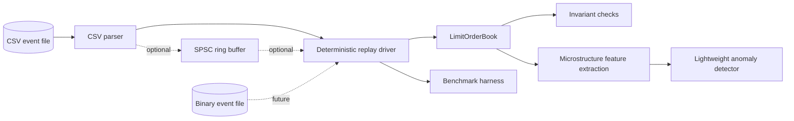

# Architecture

Datagine is organized around deterministic market-data replay into a limit order
book. The default replay path remains direct and single-threaded. An optional
SPSC handoff queue exists for parser-to-engine experiments and benchmarks, but
it is not yet used by the main replay engine. A lightweight anomaly monitor can
observe accepted replay events when explicitly enabled.

## Core Components

- **Core domain types**: strongly typed prices, quantities, order identifiers,
  timestamps, event sides, and event types.
- **Feed parser**: converts deterministic input files into normalized
  `MarketEvent` values. CSV is the first supported input format.
- **Replay driver**: applies events in input order and defines the measurement
  boundary for deterministic replay.
- **SPSC ring buffer**: optional single-producer/single-consumer handoff between
  event production and book updates.
- **Limit order book**: maintains price-time priority and validates book
  invariants after replay steps.
- **Benchmark harness**: measures latency and throughput without mixing setup,
  parsing, and book update costs unless the benchmark explicitly names that
  boundary.
- **Feature extraction**: derives spread, imbalance, depth, cancel rate, and
  burst-rate features for a small anomaly detection module.
- **Anomaly monitor**: applies online EWMA/z-score scoring to accepted replay
  events. It is monitoring only, not prediction or trading logic.

## Design Constraints

- C++20, dependency-light, and easy to build locally.
- No static global state.
- No intentional hot-path allocation in the order book once internals are
  implemented.
- Exceptions are acceptable in setup and parsing code, but not in future book
  update hot paths.
- Determinism takes priority over convenience in replay and benchmarks.
